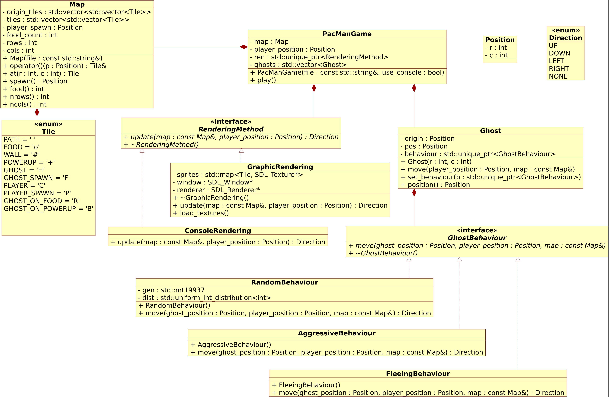

# PacMan : Projet PROG2 (ESIR2 TIS)

**_Sujet de TP réalisé pour les étudiants de deuxième année de cycle ingénieur ESIR. Réutilisation librement autorisée._**

## Introduction et rendu final

PacMan est un jeu vidéo datant de 1980, dans lequel le joueur manipule un personnage à travers un labyrinthe pour y collecter de la nourriture. Des fantômes sont également présents dans ce labyrinthe. Si le joueur rencontre l’un d’eux, la partie est terminée. Un exemple de partie de PacMan est disponible en suivant le lien suivant : [https://www.youtube.com/watch?v=dScq4P5gn4A](https://www.youtube.com/watch?v=dScq4P5gn4A).

Durant ce TP, l’objectif est de créer un jeu de PacMan en C++. Pour simplifier cette tâche, le jeu se déroulera en tour-par-tour et non pas en temps réel comme le jeu original de PacMan. À chaque nouveau tour, la partie sera affichée et le joueur choisira dans quelle direction il compte déplacer son personnage. Les fantômes choisiront également une direction dans laquelle ils se déplaceront. 

À la fin du module de PROG2, vous devrez restituer la version définitive de votre code (archivez l’intégralité du dossier projet), ainsi qu’un court rapport qui détaillera les parties les plus intéressantes de votre code, les solutions que vous avez proposées à des problèmes particuliers, vos initiatives pour améliorer le jeu, etc…

## Architecture du projet

Le projet doit être réalisé selon une architecture bien définie. Le diagramme UML suivant sert de référence pour l’organisation des différentes classes qui vont constituer le programme. Lors de l’implémentation des différentes classes, vous devrez, autant que faire se peut, suivre les descriptions qui en sont faites dans le diagramme UML : 

  

Le jeu de PacMan développé proposera deux modes d’affichage de la partie : un affichage simple dans la console, et un affichage graphique qui utilisera les fonctionnalités de la bibliothèque SDL2 ([https://wiki.libsdl.org/SDL2](https://wiki.libsdl.org/SDL2)). Ces deux méthodes hériteront de la même interface et seront utilisées de manière interchangeable par la classe principale, PacManGame, qui représente notre partie de PacMan. Pour permettre un affichage graphique de la partie, des images correspondant aux textures des différents objets d’une partie sont disponibles dans un dossier sprites. L’affichage de la partie utilisant la SDL consistera donc à placer ces textures à bon escient dans une fenêtre graphique. 

Les différentes configurations de niveaux de PacMan seront issues de fichiers texte (.txt) qui contiennent une représentation des niveaux sous forme de caractères définis dans l’énumération Tile. Ces fichiers sont lus par un objet Map, qui stocke un niveau sous la forme d’un tableau de Tile à deux dimensions. Le tableau est modifié durant la partie pour refléter les actions du joueur et des fantômes. 

A chaque nouveau tour, l’objet PacManGame affiche la partie par une méthode ou une autre, demande par cette méthode l’intention de jeu du joueur, puis demande un déplacement des fantômes. Il met enfin à jour la Map en prenant en compte tous ces déplacements. 

Dans un jeu de PacMan, les fantômes possèdent différents types de comportements. Cette mécanique est implémentée dans ce projet en déclarant une interface GhostBehaviour, de laquelle héritent tous les types de comportements existants pour les fantômes. Ceux-ci utilisent à chaque tour la position du fantôme, celle du joueur et la configuration du niveau pour décider du déplacement du fantôme qui correspondra à son comportement. Par exemple, on peut implémenter un comportement aléatoire (RandomBehaviour), qui forcera le fantôme à se déplacer de manière erratique dans n’importe quelle direction. On peut également implémenter un comportement agressif (AggressiveBehaviour), qui fera que le fantôme cherche à atteindre le joueur. 

Des bonus sont répartis dans certains niveaux (Tile::POWERUP), qui permettent au joueur de devenir temporairement invulnérable, et qui lui permettent de chasser les fantômes à son tour. Lorsqu’un fantôme est chassé de cette manière, il retourne à son point de départ. Tant que le joueur est sous l’effet du bonus, les fantômes chercheront à la fuir, il y a donc également un tel comportement à implémenter (FleeingBehaviour). 

## Étapes de réalisation

**_A la suite de cette partie se trouve une description précise de chaque classe décrite dans le diagramme UML. Cette partie ne contient que les instructions pour réaliser le TP._**

### Récupération du dossier projet

Deux archives .zip sont disponibles sur Moodle. Elles contiennent l’ensemble des fichiers nécessaire pour démarrer le projet sous Windows / Code::Blocks (codes sources, fichier projet, bibliothèques et ressources). Choisissez et décompressez : 

- PacMan-PROG2 (x86) : si vous travaillez sur une machine de l’école 
- PacMan-PROG2 (x64) : si vous travaillez sur votre propre machine 
- PacMan-PROG2 (VS) : si vous travaillez sur Visual Studio (il n’y a pas de fichier .sln, ouvrez le dossier qui contient le CMakeLists.txt) 

Décompressez le dossier vers un emplacement qui vous appartient, et ouvrez le projet (fichier .cbp) avec Code::Blocks. Vous devriez pouvoir compiler et lancer le programme.

### Code existant

Vous devez lire et comprendre le code existant. Celui-ci contient des éléments qui vont vous guider pour démarrer le projet, ou utiliser la SDL. 

1. La fonction main crée simplement un objet de type PacmanGame, et appelle sa méthode play. Si l’utilisateur choisit l’affichage graphique de la partie, la fonction main lance à la place une fonction de démonstration de la SDL, que vous pouvez essayer de comprendre pour vous aider dans l’écriture de GraphicRendering. 

2. Le fichier global.h contient les éléments Position et Direction, qui sont utilisés partout ailleurs dans le programme.

3. Vous remarquerez que l’objet PacManGame ne ressemble pas à sa description dans l’UML. La classe contient cependant des éléments importants pour la réalisation de la suite du TP. Le constructeur de la classe crée un objet de type ConsoleRendering, qui va être utilisé pour l’affichage de la partie et pour requérir l’action du joueur. A ce stade, la classe GraphicRendering n’est pas encore développée. Dans la méthode play de PacManGame, on remarque donc un appel à la fonction update de la méthode de rendu. Pour l’instant, la direction prise par le joueur n’a aucun impact sur la partie. 

4. La classe Map est largement incomplète, et se contente pour l’instant de représenter un niveau fixe et prédéterminé. 

5. La classe ConsoleRendering est déjà fonctionnelle. 

### Classe Map

Écrivez la classe Map et assurez-vous qu’elle soit en mesure de lire un fichier de niveau, et de le stocker dans un tableau de Tile à deux dimensions. Le code préexistant devrait permettre de tester le fonctionnement de la Map, en fournissant le chemin vers un fichier au constructeur de celle-ci.

### Déplacements du joueur

Pour l’instant, la direction prise par le joueur est bien captée par la classe ConsoleRendering, mais n’est pas utilisée par le PacManGame. Écrivez, dans PacManGame, les mécanismes permettant de prendre en compte les déplacements du joueur, et de modifier la Map en conséquence. Faites en sorte d’interdire les déplacements impossibles (à travers les murs). Vous pouvez, dans un premier temps expérimenter avec la carte level1.txt, qui ne contient pas de fantômes.

### Ramassage de la nourriture

Les jetons de nourriture disposés sur la carte doivent être tous atteints par PacMan pour que la partie soit gagnée. Faites en sorte que les jetons disparaissent sur le passage du joueur, et soient comptabilisés pour la victoire.

### Fantômes

Écrivez la classe abstraite GhostBehaviour, telle que décrite dans le diagramme UML. Écrivez ensuite la classe RandomBehaviour, qui représente un comportement aléatoire du fantôme. Enfin, écrivez la classe Fantôme. 

Effectuez ensuite les modifications nécessaires au code de PacManGame pour que celui-ci prenne en compte la présence et l’action de fantômes dans la partie. Au début de la partie, le PacManGame doit créer autant d’objets Ghost que de fantômes dans le niveau, et les positionner sur le Map. À chaque tour, il doit demander aux fantômes d’effectuer leur mouvement, et mettre à jour la Map en conséquence. Si le joueur entre en contact avec un fantôme la partie doit se terminer. 

Une fois ces éléments fonctionnels, vous pouvez développer des comportements plus complexes pour les fantômes.

### Affichage graphique

Utilisez le code présent dans sdl_demo.cpp pour développer la classe GraphicRendering. Elle hérite de RenderingMethod et peut être utilisée de la même manière que ConsoleRendering.

### Ramassage de bonus

Les bonus répartis sur le niveau permettent de passer le joueur dans un état d’invulnérabilité pour quelques tours. Implémentez ce mécanisme, ainsi que le comportement fuyard des fantômes lorsque le joueur est invulnérable. 

### Améliorations

Une fois que la base du jeu fonctionne, vous pouvez expérimenter des améliorations pour le rendre plus amusant. À partir de maintenant, il n’est plus nécessaire de respecter le diagramme UML, et vous pouvez entreprendre toutes les modifications nécessaires du code pour améliorer le jeu. Quelques suggestions : 

- Vous pouvez modifier votre code pour que la texture de PacMan corresponde à son orientation. 

- Il serait intéressant de pouvoir annuler le précédent coup pour en choisir un meilleur. Cela implique d’annuler non seulement le coup du joueur mais également ceux des fantômes. Vous pouvez implémenter un tel mécanisme en vous inspirant du patron de conception Command. 

- Les fantômes possèdent pour l’instant des comportements simplistes. Dans le jeu de PacMan original, les fantômes ont été programmés avec chacun une prise de décision différente ([https://gameinternals.com/understanding-pac-man-ghost-behavior](https://gameinternals.com/understanding-pac-man-ghost-behavior)). Vous pouvez modifier votre code pour que les différents fantômes apparaissent de différentes couleurs (plusieurs textures sont fournies dans le dossier associé au projet), et aient des comportements similaires à ceux du jeu original. 

- Vous pourriez configurer le jeu pour permettre au joueur de sauvegarder la partie, pour la reprendre plus tard. 

- Vous pouvez faire en sorte que plusieurs niveaux s’enchaînent, et de mettre en place un système de calcul de score (nourriture ramassée, fantômes chassés etc…) 

- Vous pouvez intégrer des affichages d’informations dans la fenêtre graphique, pour cela, vous aurez besoin de la bibliothèque SDL_ttf ([https://github.com/libsdl-org/SDL_ttf](https://github.com/libsdl-org/SDL_ttf)). Il faut en télécharger les fichiers et configurer Code::Blocks pour ajouter à l’éditeur de lien des références à SDL_ttf. 

Vous pouvez choisir d’implémenter n’importe quelle idée qui vous viendra pour améliorer l’expérience de jeu. Ces développements, même inachevés, seront valorisés si leur recherche est décrite dans votre rapport.

## Détail des classes

### Énumération Direction

Cette énumération permet de représenter une direction empruntée par le joueur ou par un fantôme. Elle peut prendre plusieurs valeurs : 

- UP, DOWN, LEFT, RIGHT : 4 directions possible pour un déplacement 
- NONE : pour représenter le cas où aucun déplacement n’est entrepris

### Structure Position

La structure sert à faciliter les échanges de coordonnées entre les différentes méthodes. Elle contient deux attributs, r et c, qui représentent respectivement les indices d’une ligne et d’une colonne dans le niveau.

### Énumération Tile

Cette énumération de caractères sert à représenter les différents états possibles des cases d’un niveau. Elle contient les valeurs : 

- PATH : représente un chemin ouvert 
- FOOD : représente un chemin ouvert sur lequel est placé un jeton de nourriture 
- WALL : représente un obstacle infranchissable par le joueur ou par des fantômes 
- POWERUP : représente un chemin ouvert sur lequel est placé un bonus 
- GHOST : une case sur laquelle un fantôme est placé 
- GHOST_SPAWN : une case sur laquelle doit apparaître un fantôme au début de la partie 
- PLAYER : une case sur laquelle est situé le joueur 
- PLAYER_SPAWN : la case sur laquelle est situé le joueur au début de la partie 
- GHOST_ON_FOOD : une case contenant à la fois un fantôme et un jeton de nourriture 
- GHOST_ON_POWERUP : une case contenant à la fois un fantôme et un bonus

### Classe Map

La classe Map représente la configuration d’un niveau de PacMan ainsi que son état à ce tour. Elle utilise pour ce faire des tableaux de Tile à deux dimensions. Les méthodes qu’elle expose permettent de charger un niveau, de lire et modifier l’état des Tile du niveau, et de remettre à zéro la configuration. 

Attributs : 
- origin_tiles : tableau contenant la configuration initiale du niveau, qui sera utilisée lors de la remise à zéro de celui-ci. 
- tiles : tableau contenant le contenu de chaque case du niveau à l’instant présent. Il est mis à jour à chaque nouveau tour pour refléter les actions du joueur et des fantômes. 
- player_spawn : Position de départ du joueur dans le niveau 
- food_count : nombre de jetons de nourritures à ramasser dans le niveau. 
- cols, rows : nombre de colonnes et de lignes qui composent le niveau. 

Méthodes : 
- Map : seul constructeur explicite de la classe. Il initialise une Map à partir d’un fichier en faisant appel à load. 
- load : méthode qui lit un fichier descriptif d’un niveau et configure l’objet Map pour représenter ce niveau. 
- reset : réinitialise l’état du niveau, en utilisant la variable origin_tiles. 
- operator() : surcharge de l’opérateur () qui retourne une référence sur la case correspondante. Elle permet de mettre à jour les cases de manière simple. 
- at : méthode qui retourne la valeur d’une case du niveau. Elle est utilisée dans le cas où aucune modification de la case n’est nécessaire. 
- spawn : retourne la position du point de départ du joueur. 
- food : retourne le nombre de jetons de nourriture à ramasser dans le niveau. 
- ncols, nrows : retournent le nombre de colonnes et de lignes qui composent le niveau. 

### Classe PacManGame
Il s’agit de la classe qui gère le déroulement de la partie de PacMan. Elle détient un objet de type Map, ainsi qu’une liste des fantômes présents sur le niveau. Au fur et à mesure de la partie, elle met à jour la Map en fonction des intentions du joueur et des fantômes. Elle possède également un pointeur unique sur un objet de type RenderingMethod. Cet objet représente le mode de rendu utilisé (dans la console ou affichage graphique), et est chargé, via sa méthode update, de l’affichage de la partie ainsi que de la requête et de la transmission des intentions du joueur. L’objet PacManGame fera donc appel à cette méthode à chaque tour. 

Attributs : 
- map : le niveau en cours 
- player_position : la position actuelle du joueur dans le niveau 
- ren : la méthode de rendu 
- ghosts : la liste des fantômes présents dans le niveau 

Méthodes : 
- PacManGame : constucteur de la partie. Il prend en paramètre un chemin vers un fichier, qu’il utilise pour initialiser l’objet map, ainsi qu’un booléen qui détermine quelle méthode de rendu sera utilisée (console ou graphique). En fonction de ce booléen, le constructeur instancie donc une méthode de rendu correspondante. 
- play : méthode appelée pour lancer une partie.

### Classe RenderingMethod
Cette classe abstraite représente l’interface d’une méthode de rendu du jeu de PacMan. Le rôle d’une telle méthode de rendu est à chaque tour d’afficher l’état actuel de la partie et de recueillir les intentions du joueur. Pour ce faire, l’interface RenderingMethod expose deux méthodes virtuelles : 

- update : cette méthode reçoit la Map actualisée ainsi que la position du joueur. Ces informations lui suffisent à afficher l’état actuel de la partie à l’utilisateur. Les classes filles redéfiniront cette méthode (définie comme virtuelle pure dans cette classe), en tirant partie de leurs méthodes d’affichage propres. La méthode update doit retourner une Direction, qui correspond à l’intention de déplacement du joueur. Il faut donc, après affichage de la partie, que la méthode de rendu recueille une entrée de l’utilisateur qui représente cette intention. 

- ~RenderingMethod : le destructeur d’une classe mère doit impérativement être déclaré comme virtuel, pour permettre aux constructeurs des classes filles d’être appelés.

### Classe ConsoleRendering

La classe ConsoleRendering hérite de la classe RenderingMethod et redéfinit la méthode update de manière à afficher l’état de la partie en cours dans la console, et à recueillir dans cette même console l’intention de déplacement du joueur. 

### Classe GraphicsRendering
La classe GraphicRendering hérite elle aussi de la classe RenderingMethod, mais est une spécialisation de celle-ci qui permet l’affichage de la partie dans un contexte graphique grâce à la bibliothèque SDL2. Elle redéfinit elle aussi la fonction update, mais possède également des attributs qui lui permettent de gérer l’utilisation d’une fenêtre graphique. 

Attributs : 

- sprites : cette table conserve en mémoire les différentes textures nécessaires pour afficher la partie. Elle associe à chacune des valeurs possibles de l’énumération Tile la texture correspondante à afficher. Les textures sont conservées sous formes de pointeurs de type SDL_Texture*. 

- window : cet attribut permet de conserver la fenêtre générée lors du lancement de la partie, et dans laquelle se font tous les affichages. 

- renderer : ce pointeur donne accès au SDL_Renderer qui gère l’affichage de textures dans la fenêtre. 

Méthodes : 

- update() : lors du premier appel à cette méthode, celle-ci crée la fenêtre d’affichage ainsi que le Renderer. Elle commande également le chargement des textures en mémoire, en appelant la fonction load_textures. Ensuite, et lors appels suivants, elle utilise ces différentes ressources pour réaliser l’affichage de l’état de la partie, et recueille le déplacement commandé par le joueur. 

- load_textures : cette méthode remplit la table sprites en chargeant les différentes textures contenues dans les fichiers .bmp. 

- ~GraphicsRendering : le destructeur de la classe GraphicsRendering doit libérer la mémoire allouée dynamiquement par les objets de SDL2. Il doit donc utiliser les fonction adéquates pour détruire window et renderer (les textures associées sont libérées automatiquement lorsque le renderer est détruit).

### Classe Ghost

La classe Ghost représente un fantôme dans une partie. Elle contient les informations de position, d’origine et de comportement du fantôme. Les méthodes publiques permettent d’interagir avec le fantôme, en recueillant sa position, son intention de déplacement, et en lui imposant un comportement. 

Attributs : 
- origin : la première position occupée par le fantôme, il peut y être renvoyé en cours de partie. 
- pos : la position actuelle du fantôme. 
- behaviour : un pointeur unique sur une objet de type GhostBehaviour, qui représente le comportement du fantôme. 

Méthodes : 
- ghost : le constructeur du fantôme initialise sa position 
- set_behaviour : un appel à cette méthode permet d’imposer le comportement du fantôme, en lui passant en argument un pointeur unique sur un objet dérivé de GhostBehaviour. 
- move : cette méthode fait appel au comportement du fantôme, qui utilise la position du joueur, du fantôme et l’état de la partie pour déterminer la prochaine action du fantôme. 
- set_position : permet de modifier la position du fantôme 
- position : permet de lire la position du fantôme 
- get_origin : permet de lire la position d’origine du fantôme

### Classe GhostBehaviour

Cette classe abstraite sert d’interface pour le comportement d’un fantôme dans une partie. Elle expose une méthode permettant de demander une prise de décision à partir d’informations sur la configuration de la partie. La méthode move est appelée par le fantôme propriétaire de l’objet dérivé de GhostBehaviour, et retourne l’intention du fantôme sous la forme d’une Direction. Cette décision peut être prise en considérant la position du joueur, celle du fantôme et l’état général de la partie.

### Classe RandomBehaviour

Cette classe dérivée de GhostBehaviour représente un comportement erratique du fantôme, qui prend chaque décision de manière aléatoire. 

Attributs : 
- gen : le générateur de nombres aléatoires utilisé par le comportement pour choisir la direction du fantôme. 
- dist : la distribution vers laquelle les valeurs générées sont ramenées. 

Méthodes : 
- move : la méthode move est redéfinie par la classe RandomBehaviour, et choisit au hasard une direction pour le fantôme, parmi celles disponibles en fonction de sa position (la méthode ne doit pas autoriser le fantôme à se diriger dans un mur). 

### Classe AggressiveBehaviour

Cette classe, aussi dérivée de GhostBehaviour, représente un comportement agressif d’un fantôme, qui cherchera à se rapprocher du joueur jusqu’à l’atteindre. Pour ce faire, la méthode move utilisera les informations de position du joueur, de position du fantôme ainsi que de configuration du niveau. Vous êtes libre de l’implémentation de ce comportement. Favorisez dans un premier temps les méthodes les plus « naïves ».

### Classe FleeingBehaviour

Ce comportement est adopté par les fantômes qui sont effrayés par le joueur (lorsque celui-ci attrape un bonus). A l’inverse de AggressiveBehaviour, l’objectif de la méthode move sera alors de retourner la direction qui éloigne le fantôme du joueur.

